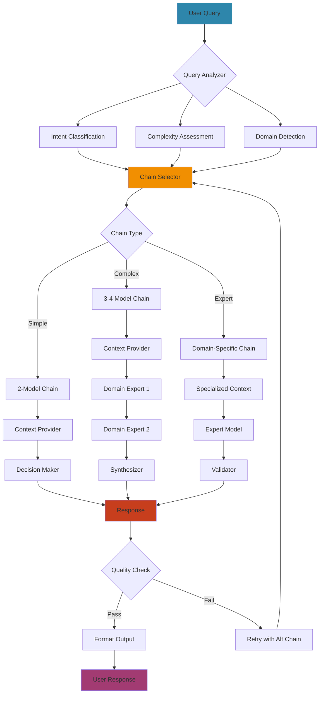
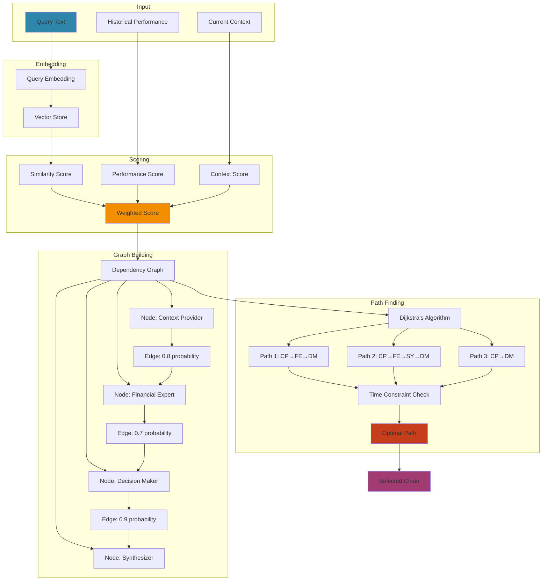
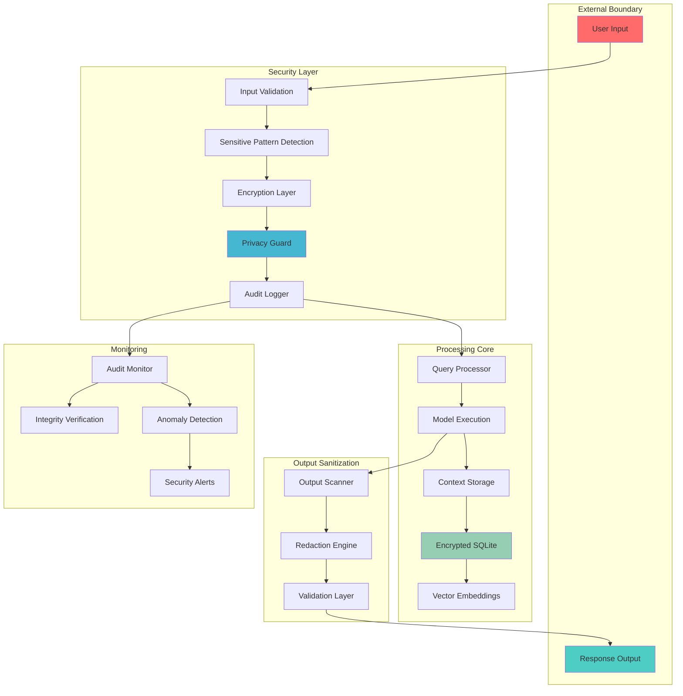

# Mirador Architecture Diagrams

## 1. High-Level System Architecture (ASCII)

```
┌─────────────────────────────────────────────────────────────────────────────────┐
│                              MIRADOR AI ORCHESTRATION                            │
├─────────────────────────────────────────────────────────────────────────────────┤
│                                                                                  │
│  User Layer                                                                      │
│  ┌──────────┐  ┌──────────┐  ┌──────────┐  ┌──────────┐  ┌──────────┐        │
│  │ Terminal │  │  Scripts │  │ Prompts  │  │   Web    │  │   API    │        │
│  │   CLI    │  │  (bash)  │  │ Library  │  │ Interface│  │ Endpoints│        │
│  └────┬─────┘  └────┬─────┘  └────┬─────┘  └────┬─────┘  └────┬─────┘        │
│       │              │              │              │              │              │
│       └──────────────┴──────────────┴──────────────┴──────────────┘             │
│                                     │                                            │
│  ┌──────────────────────────────────▼──────────────────────────────────┐       │
│  │                         Query Processing Layer                        │       │
│  │  ┌────────────┐  ┌─────────────┐  ┌──────────────┐  ┌────────────┐ │       │
│  │  │   Query    │  │   Intent    │  │   Context    │  │   Chain    │ │       │
│  │  │  Parser    │─▶│  Analyzer   │─▶│  Enrichment  │─▶│  Planner   │ │       │
│  │  └────────────┘  └─────────────┘  └──────────────┘  └────────────┘ │       │
│  └──────────────────────────────────────────────────────────────────────┘       │
│                                     │                                            │
│  ┌──────────────────────────────────▼──────────────────────────────────┐       │
│  │                        Orchestration Engine                          │       │
│  │  ┌────────────┐  ┌─────────────┐  ┌──────────────┐  ┌────────────┐ │       │
│  │  │   Model    │  │   Chain     │  │   Context    │  │  Response  │ │       │
│  │  │  Selector  │  │  Executor   │  │ Propagator   │  │ Synthesizer│ │       │
│  │  └─────┬──────┘  └──────┬──────┘  └──────┬───────┘  └─────┬──────┘ │       │
│  │        │                 │                 │                 │        │       │
│  │  ┌─────▼─────────────────▼─────────────────▼─────────────────▼──────┐│       │
│  │  │                    Execution Pipeline                             ││       │
│  │  │  [Model 1] ──▶ [Context] ──▶ [Model 2] ──▶ [Context] ──▶ [Model N]││       │
│  │  └───────────────────────────────────────────────────────────────────┘│       │
│  └──────────────────────────────────────────────────────────────────────┘       │
│                                     │                                            │
│  ┌──────────────────────────────────▼──────────────────────────────────┐       │
│  │                         Model Repository                             │       │
│  │  ┌─────────────────────────┐  ┌─────────────────────────┐          │       │
│  │  │   Context Providers (5)  │  │   Domain Experts (28)   │          │       │
│  │  ├─────────────────────────┤  ├─────────────────────────┤          │       │
│  │  │ • matthew_context_v3     │  │ • financial_expert_v6   │          │       │
│  │  │ • personality_provider   │  │ • guitar_tone_architect │          │       │
│  │  │ • louisville_context     │  │ • music_industry_network│          │       │
│  │  │ • family_context         │  │ • career_transition_spec│          │       │
│  │  │ • goal_context           │  │ • tax_optimization_exp  │          │       │
│  │  └─────────────────────────┘  └─────────────────────────┘          │       │
│  │                                                                      │       │
│  │  ┌─────────────────────────┐  ┌─────────────────────────┐          │       │
│  │  │    Synthesizers (12)    │  │  Decision Makers (8)    │          │       │
│  │  ├─────────────────────────┤  ├─────────────────────────┤          │       │
│  │  │ • cross_model_synth      │  │ • decision_simplifier_v3│          │       │
│  │  │ • insight_aggregator     │  │ • action_prioritizer    │          │       │
│  │  │ • pattern_recognizer     │  │ • risk_assessor         │          │       │
│  │  │ • opportunity_mapper     │  │ • timeline_optimizer    │          │       │
│  │  └─────────────────────────┘  └─────────────────────────┘          │       │
│  └──────────────────────────────────────────────────────────────────────┘       │
│                                     │                                            │
│  ┌──────────────────────────────────▼──────────────────────────────────┐       │
│  │                       Infrastructure Layer                           │       │
│  │  ┌─────────────┐  ┌──────────────┐  ┌──────────────┐  ┌──────────┐│       │
│  │  │   Ollama    │  │   SQLite     │  │   Vector     │  │  Cache   ││       │
│  │  │  Inference  │  │   Memory     │  │   Store      │  │  Layer   ││       │
│  │  │   Engine    │  │   (22MB)     │  │ (Embeddings) │  │  (Redis) ││       │
│  │  └─────────────┘  └──────────────┘  └──────────────┘  └──────────┘│       │
│  │                                                                      │       │
│  │  ┌────────────────────────────────────────────────────────────────┐│       │
│  │  │                     Hardware Layer                              ││       │
│  │  │  Apple Silicon M3 Max - 48GB Unified Memory - 16 GPU Cores     ││       │
│  │  └────────────────────────────────────────────────────────────────┘│       │
│  └──────────────────────────────────────────────────────────────────────┘       │
└─────────────────────────────────────────────────────────────────────────────────┘
```

## 2. Chain Execution Flow (Mermaid)



## 3. Context Propagation Mechanism (ASCII)

```
┌─────────────────────────────────────────────────────────────────────┐
│                    CONTEXT PROPAGATION FLOW                          │
├─────────────────────────────────────────────────────────────────────┤
│                                                                      │
│  Model 1 Output                                                      │
│  ┌─────────────────────────────────────────────────────────┐       │
│  │ Based on Matthew's context as a Risk Management         │       │
│  │ Professional earning $85k with a 7-year-old daughter... │       │
│  │                                                          │       │
│  │ Key Insights:                                            │       │
│  │ • Financial stability important for family              │       │
│  │ • Limited time due to parenting responsibilities        │       │
│  │ • Music career requires 3-year transition plan          │       │
│  └───────────────────┬─────────────────────────────────────┘       │
│                      │                                              │
│                      ▼                                              │
│  ┌─────────────────────────────────────────────────────────┐       │
│  │              SEMANTIC EXTRACTOR                          │       │
│  │  ┌─────────────┐  ┌──────────────┐  ┌───────────────┐  │       │
│  │  │   Entity    │  │   Concept    │  │    Priority   │  │       │
│  │  │ Recognition │  │  Extraction  │  │   Detection   │  │       │
│  │  └──────┬──────┘  └──────┬───────┘  └───────┬───────┘  │       │
│  │         │                 │                   │          │       │
│  │         ▼                 ▼                   ▼          │       │
│  │    [Matthew]        [Transition]         [3 years]      │       │
│  │    [$85k]          [Stability]          [Family]        │       │
│  │    [Aurora]        [Music Career]       [Limited Time]  │       │
│  └─────────────────────────┬───────────────────────────────┘       │
│                            │                                        │
│                            ▼                                        │
│  ┌─────────────────────────────────────────────────────────┐       │
│  │            CONTEXT BUILDER FOR MODEL 2                   │       │
│  │                                                          │       │
│  │  Previous Analysis Summary:                              │       │
│  │  ├─ Financial: $85k income, family obligations          │       │
│  │  ├─ Timeline: 3-year music transition goal              │       │
│  │  ├─ Constraints: Limited time, stability needs          │       │
│  │  └─ Priorities: Family first, gradual transition        │       │
│  │                                                          │       │
│  │  Model 2 Instructions:                                   │       │
│  │  "Building on the above context, analyze specific       │       │
│  │   financial strategies that maintain stability while     │       │
│  │   enabling music career development..."                  │       │
│  └─────────────────────────┬───────────────────────────────┘       │
│                            │                                        │
│                            ▼                                        │
│  Model 2 Input (with propagated context)                           │
│  ┌─────────────────────────────────────────────────────────┐       │
│  │ [System Prompt] + [Propagated Context] + [User Query]   │       │
│  └─────────────────────────────────────────────────────────┘       │
│                                                                      │
└─────────────────────────────────────────────────────────────────────┘
```

## 4. Model Selection Algorithm (Mermaid)



## 5. Performance Architecture (ASCII)

```
┌─────────────────────────────────────────────────────────────────────┐
│                     PERFORMANCE OPTIMIZATION                         │
├─────────────────────────────────────────────────────────────────────┤
│                                                                      │
│  Request Pipeline                                                    │
│  ┌─────────────┐     ┌─────────────┐     ┌─────────────┐          │
│  │   Incoming  │     │   Cache     │     │   Cache     │          │
│  │    Query    │────▶│   Check     │────▶│    Hit?     │          │
│  └─────────────┘     └─────────────┘     └──────┬──────┘          │
│                                                  │                  │
│                              ┌───────────────────┴──────┐           │
│                              │                          │           │
│                              ▼                          ▼           │
│                        ┌───────────┐            ┌──────────────┐   │
│                        │  Return   │            │  Execute     │   │
│                        │  Cached   │            │  Fresh       │   │
│                        │  Result   │            │  Chain       │   │
│                        └───────────┘            └──────┬───────┘   │
│                                                        │           │
│  Model Loading Strategy                                │           │
│  ┌─────────────────────────────────────────────────────▼──────┐   │
│  │                                                             │   │
│  │  ┌──────────────┐    ┌──────────────┐    ┌──────────────┐ │   │
│  │  │ Preload      │    │ Lazy Load    │    │ Parallel     │ │   │
│  │  │ Common       │    │ Rare         │    │ Load         │ │   │
│  │  │ Models       │    │ Models       │    │ Independent  │ │   │
│  │  └──────────────┘    └──────────────┘    └──────────────┘ │   │
│  │                                                             │   │
│  │  Memory Pool: 18.4GB                                        │   │
│  │  ├─ Model 1: 3.2GB  (Always Loaded)                        │   │
│  │  ├─ Model 2: 3.2GB  (Always Loaded)                        │   │
│  │  ├─ Model 3: 3.2GB  (Lazy Load)                            │   │
│  │  └─ Available: 8.8GB                                        │   │
│  └─────────────────────────────────────────────────────────────┘   │
│                                                                      │
│  Execution Timeline                                                  │
│  ┌─────────────────────────────────────────────────────────────┐   │
│  │                                                               │   │
│  │  0s     10s    20s    30s    40s    50s    60s              │   │
│  │  │───────│──────│──────│──────│──────│──────│               │   │
│  │  │                                                           │   │
│  │  │▓▓▓▓│ Query Analysis (3s)                                 │   │
│  │  │    │▓▓▓▓▓▓▓▓│ Model Loading (8s)                        │   │
│  │  │              │▓▓▓▓▓▓▓▓▓▓▓▓│ Model 1 Inference (12s)     │   │
│  │  │                           │▓▓│ Context Prop (2s)         │   │
│  │  │                              │▓▓▓▓▓▓▓▓▓▓│ Model 2 (10s) │   │
│  │  │                                         │▓│ Synthesis(2s)│   │
│  │  │                                                           │   │
│  │  Total: 37s                                                  │   │
│  └─────────────────────────────────────────────────────────────┘   │
│                                                                      │
│  Optimization Opportunities                                          │
│  ┌─────────────────────────────────────────────────────────────┐   │
│  │                                                               │   │
│  │  1. Parallel Execution:    -40% time (22s total)            │   │
│  │  2. Model Quantization:    -50% memory, -20% time            │   │
│  │  3. Semantic Caching:      -60% for repeated patterns        │   │
│  │  4. Batch Processing:      -30% for multiple queries         │   │
│  │                                                               │   │
│  └─────────────────────────────────────────────────────────────┘   │
└─────────────────────────────────────────────────────────────────────┘
```

## 6. Security Architecture (Mermaid)



## 7. Data Flow Diagram (ASCII)

```
┌─────────────────────────────────────────────────────────────────────┐
│                         DATA FLOW ARCHITECTURE                       │
├─────────────────────────────────────────────────────────────────────┤
│                                                                      │
│  Input Stage                                                         │
│  ┌──────────┐      ┌──────────┐      ┌──────────┐                 │
│  │  Query   │      │ Context  │      │ History  │                 │
│  │  String  │      │  State   │      │  Cache   │                 │
│  └────┬─────┘      └────┬─────┘      └────┬─────┘                 │
│       │                  │                  │                       │
│       └──────────────────┴──────────────────┘                       │
│                          │                                          │
│                          ▼                                          │
│  ┌─────────────────────────────────────────────────────────┐       │
│  │                  Data Transformation                      │       │
│  │  ┌────────────┐  ┌────────────┐  ┌────────────┐        │       │
│  │  │ Tokenizer  │  │ Embedder   │  │ Normalizer │        │       │
│  │  └─────┬──────┘  └─────┬──────┘  └─────┬──────┘        │       │
│  │        │                │                │               │       │
│  │        ▼                ▼                ▼               │       │
│  │   [Tokens]         [Vectors]        [Metadata]          │       │
│  └──────────────────────┬──────────────────────────────────┘       │
│                         │                                           │
│                         ▼                                           │
│  ┌─────────────────────────────────────────────────────────┐       │
│  │                   Model Processing                       │       │
│  │                                                          │       │
│  │  ┌─────────┐    ┌─────────┐    ┌─────────┐            │       │
│  │  │ Model 1 │───▶│ Model 2 │───▶│ Model N │            │       │
│  │  └────┬────┘    └────┬────┘    └────┬────┘            │       │
│  │       │               │               │                 │       │
│  │       ▼               ▼               ▼                 │       │
│  │  [Output 1]      [Output 2]      [Output N]            │       │
│  └───────────────────────┬─────────────────────────────────┘       │
│                          │                                          │
│                          ▼                                          │
│  ┌─────────────────────────────────────────────────────────┐       │
│  │                    Data Storage                          │       │
│  │                                                          │       │
│  │  ┌──────────────┐  ┌──────────────┐  ┌──────────────┐ │       │
│  │  │   SQLite     │  │   Vector     │  │   Cache      │ │       │
│  │  │   Tables     │  │   Index      │  │   Store      │ │       │
│  │  ├──────────────┤  ├──────────────┤  ├──────────────┤ │       │
│  │  │ • chains     │  │ • embeddings │  │ • results    │ │       │
│  │  │ • outputs    │  │ • similarity │  │ • patterns   │ │       │
│  │  │ • metrics    │  │ • clusters   │  │ • frequent   │ │       │
│  │  │ • audit_log  │  │              │  │              │ │       │
│  │  └──────────────┘  └──────────────┘  └──────────────┘ │       │
│  └─────────────────────────────────────────────────────────┘       │
│                                                                      │
│  Output Stage                                                        │
│  ┌──────────┐      ┌──────────┐      ┌──────────┐                 │
│  │ Response │      │ Metrics  │      │  Audit   │                 │
│  │ Synthesis│      │  Update  │      │   Log    │                 │
│  └──────────┘      └──────────┘      └──────────┘                 │
│                                                                      │
└─────────────────────────────────────────────────────────────────────┘
```

These diagrams provide comprehensive visualization of:
- System architecture and component relationships
- Chain execution flow and decision logic
- Context propagation between models
- Model selection algorithm
- Performance optimization strategies
- Security implementation
- Complete data flow through the system

Each diagram offers a different perspective on Mirador's sophisticated orchestration capabilities while maintaining clarity for technical audiences.