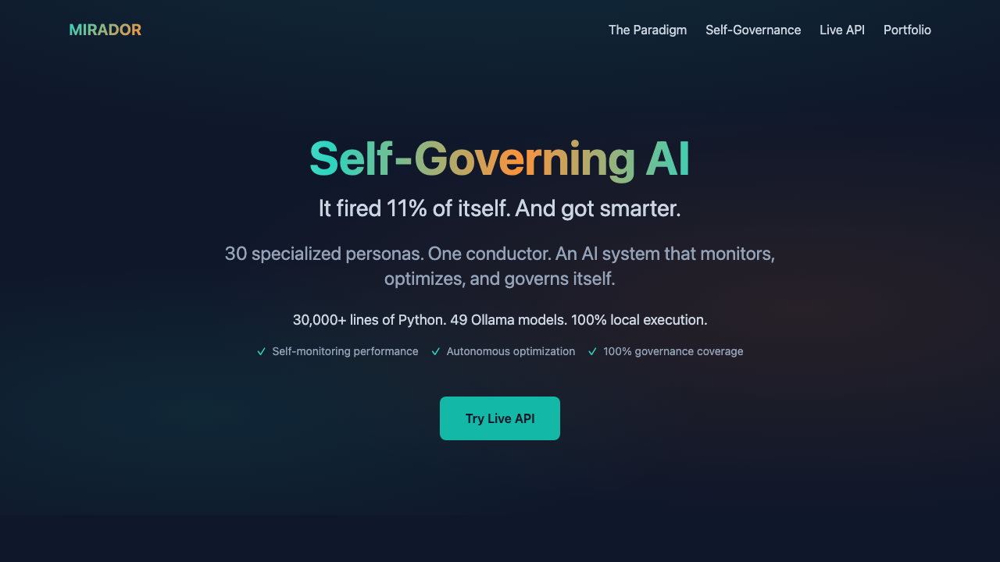

# Mirador

<p align="center">
  
</p>

<p align="center">
  <strong>30 specialized personas. One conductor. Local execution. Personality-aware intelligence.</strong>
</p>

<p align="center">
  <a href="https://mirador.projectlavos.com">Live Demo</a> ·
  <a href="#architecture">Architecture</a> ·
  <a href="#quick-start">Quick Start</a>
</p>

---

An AI orchestration framework built because no existing tool could handle the complexity of actual life.

## The Paradigm

Traditional AI tools fail at complex, multi-domain problems. They lack context persistence, personality awareness, and the ability to route tasks to specialized capabilities. Life doesn't fit in a single prompt.

Mirador implements a **conductor-based orchestration pattern**. One meta-agent analyzes incoming tasks and dynamically assembles chains of specialized personas. Each persona has domain expertise, tuned parameters, and awareness of the user's personality profile (OCEAN/Big Five integration).

## By the Numbers

| Metric | Count |
|--------|-------|
| Specialized Personas | 30 |
| Ollama Models | 49 installed |
| Lines of Python | 30,000+ |
| Shell Scripts | 877 |
| Execution | 100% local |

## Architecture

```
User Query
    │
    ▼
┌───────────────────────────────────────────────────┐
│  Conductor Agent (conductor.py)                   │
│  - Analyzes task requirements                     │
│  - Selects optimal persona chain                  │
│  - Routes with sub-second latency                 │
└───────────────────────────────────────────────────┘
    │
    ▼
┌───────────────────────────────────────────────────┐
│  Mesfamily_member Bus (mesfamily_member_bus.py)                     │
│  - Bidirectional specialist communication         │
│  - Session management with UUID                   │
│  - Query caching & circular dependency detection  │
└───────────────────────────────────────────────────┘
    │
    ▼
┌───────────────────────────────────────────────────┐
│  Persona Chains (30 specialists)                  │
│  ┌─────────────┐ ┌─────────────┐ ┌─────────────┐ │
│  │   Guitar    │ │  Financial  │ │  Security   │ │
│  │  Experts    │ │  Planning   │ │   Audit     │ │
│  └─────────────┘ └─────────────┘ └─────────────┘ │
│  ┌─────────────┐ ┌─────────────┐ ┌─────────────┐ │
│  │ Louisville  │ │   Health    │ │    Code     │ │
│  │   Market    │ │  Wellness   │ │   Review    │ │
│  └─────────────┘ └─────────────┘ └─────────────┘ │
└───────────────────────────────────────────────────┘
    │
    ▼
┌───────────────────────────────────────────────────┐
│  Meta-Cognitive Layer                             │
│  - cross_model_synthesizer: Pattern identification│
│  - feedback_loop_optimizer: Output refinement     │
│  - self_reflection_guardian: Blindspot detection  │
└───────────────────────────────────────────────────┘
    │
    ▼
┌───────────────────────────────────────────────────┐
│  Ollama (Local LLM Runtime)                       │
│  llama3.2, phi4, qwen2.5, deepseek-r1, gemma2    │
└───────────────────────────────────────────────────┘
```

## Persona Categories

### Domain Specialists

| Category | Example Personas |
|----------|------------------|
| **Music & Guitar** | `guitar_expert_precise`, `guitar_tone_architect`, `master_guitar_instructor`, `performance_anxiety_coach` |
| **Career & Market** | `louisville_expert_v2`, `louisville-job-market`, `local_market_expert`, `opportunity_identification_specialist` |
| **Financial** | `financial_planning_expert_v6`, `financial_calculator`, `decision_enhancer`, `decision_simplifier_v2` |
| **Code & Security** | `code-executor`, `elite-frontend`, `fact_validation_specialist`, `security_expert` |
| **Health & Wellness** | `health_wellness_optimizer`, `touring_readiness_coach`, `productivity_optimizer` |

### Meta-Cognitive Layer

| Model | Function |
|-------|----------|
| `cross_model_synthesizer` | Identifies patterns across specialist outputs |
| `mirador_self_reflection_guardian` | Detects blindspots and biases |
| `feedback_loop_optimizer` | Refines outputs iteratively |
| `instruction_generation_specialist` | Creates actionable next steps |

## OCEAN Personality Integration

Mirador integrates Big Five personality traits to personalize recommendations:

- **Openness** → Creative Innovation chains
- **Conscientiousness** → Family-Conscious Planning
- **Extraversion** → Depth-Focused Networking
- **Agreeableness** → Values-Based Leadership
- **Neuroticism** → Resilience/Adaptive strategies

Personality data shapes which specialists activate and how they frame recommendations.

## Quick Start

```bash
# 1. Install Ollama
curl -fsSL https://ollama.ai/install.sh | sh

# 2. Clone & Install
git clone https://github.com/guitargnarr/mirador
cd mirador && pip install -r requirements.txt

# 3. Start API
python api.py

# 4. Verify
curl http://localhost:5001/api/health
```

## API Endpoints

| Endpoint | Method | Description |
|----------|--------|-------------|
| `/api/health` | GET | Health check |
| `/api/personas` | GET | List all personas |
| `/api/run` | POST | Run chain with input |
| `/api/run/<persona>` | POST | Run single persona |
| `/api/webhooks` | GET/POST | Webhook management |

## Advanced Features

### Hybrid Chains
Combine multiple base LLMs for comprehensive analysis:

```bash
./bin/mirador_hybrid_chains.sh synthesis "Complex query" --quality
./bin/mirador_hybrid_chains.sh technical "Architecture question"
./bin/mirador_hybrid_chains.sh decision "Should I do X or Y?"
```

### RAG Chains
Document analysis with Command-R:

```bash
./bin/mirador_rag_chain.sh document "Key findings?" /path/to/doc.pdf
./bin/mirador_rag_chain.sh code "Explain architecture" /path/to/codebase
```

### Auto Router
Intelligent query routing:

```bash
./bin/mirador_auto_router.sh "your query" --verbose
```

### Smart Chain Execution

```bash
# Universal runner with format options
./bin/mirador_universal_runner_v3_optimized.sh life_optimization "Your prompt" detailed

# Quick interface
./bin/mirador-ez chain "Your query" model1 model2 model3

# Smart routing
./bin/mirador-smart-v2 "Help me with career planning"
```

## Core Components

| File | Lines | Purpose |
|------|-------|---------|
| `src/ai_framework/framework.py` | 28,421 | Main orchestration |
| `src/ai_framework/conductor.py` | 16,709 | Dynamic task routing |
| `src/ai_framework/core/mesfamily_member_bus.py` | 25,567 | Agent communication |
| `src/ai_framework/core/specialist_handler.py` | 20,762 | Model invocation |
| `src/ai_framework/core/intervention_manager.py` | 33,267 | Human-in-the-loop |
| `api.py` | 558 | Flask REST API |

## Validated Results

| Chain | Accuracy | Best For |
|-------|----------|----------|
| `security_audit` | **100%** | CORS, auth, injection, secrets |
| `life_optimization` | High | Multi-domain planning |
| `architecture` | ~70% | Design review |

**Real Result:** Mirador's security audit chain found a CORS vulnerability (`allow_origins=["*"]` with credentials) in a production API that was subsequently fixed and deployed.

## Philosophy

AI should augment human capability, not replace human judgment. Mirador runs locally because privacy is non-negotiable. It's personality-aware because generic advice is useless advice. It chains specialists because no single model can do everything well.

This isn't just another AI tool. It's a personal intelligence amplifier.

## Requirements

- Python 3.11+
- Ollama installed and running
- ~50GB disk space for models
- Apple Silicon recommended (M-series)

## Research Alignment

Mirador implements meta-cognitive patterns aligned with current AI agent research:

- [Microsoft AI Agents - Metacognition](https://microsoft.github.io/ai-agents-for-beginners/09-metacognition/)
- [Honda Research - Meta-Cognitive Agentic AI](https://usa.honda-ri.com/-/meta-cognitive-agentic-ai-systems)
- [Self-Evolving Agents (arxiv:2508.00271)](https://arxiv.org/abs/2508.00271)

## License

MIT

---

## Live Resources

| Resource | URL |
|----------|-----|
| **API (Render)** | [mirador-xva2.onrender.com](https://mirador-xva2.onrender.com) |
| **Landing Page** | [mirador-9kfgysimq-matthew-scotts-projects-1dc9743e.vercel.app](https://mirador-9kfgysimq-matthew-scotts-projects-1dc9743e.vercel.app) |

### Try the API

```bash
# Health check
curl https://mirador-xva2.onrender.com/api/health

# List all 30 personas
curl https://mirador-xva2.onrender.com/api/personas

# View architecture
curl https://mirador-xva2.onrender.com/api/architecture

# OCEAN personality profile
curl https://mirador-xva2.onrender.com/api/ocean

# Run a chain (demo mode)
curl -X POST https://mirador-xva2.onrender.com/api/run \
  -H "Content-Type: application/json" \
  -d '{"chain": "security_audit", "input": "Review my API for vulnerabilities"}'
```
