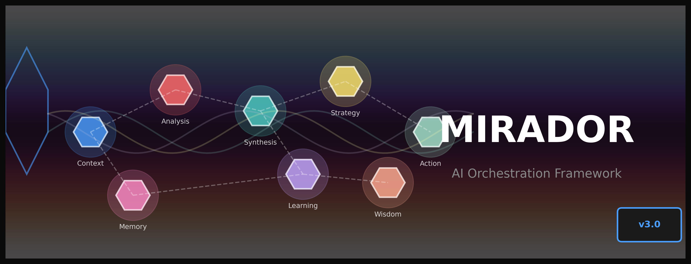
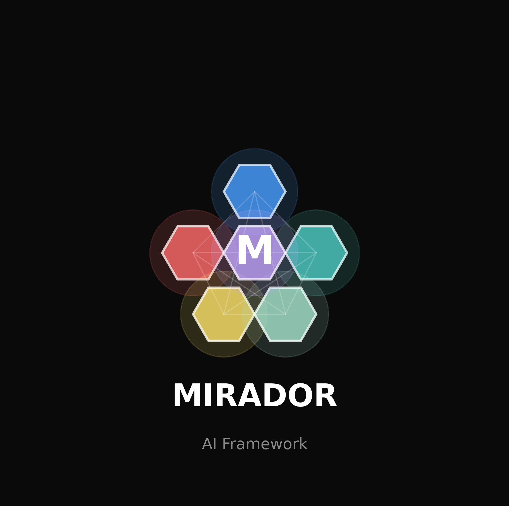
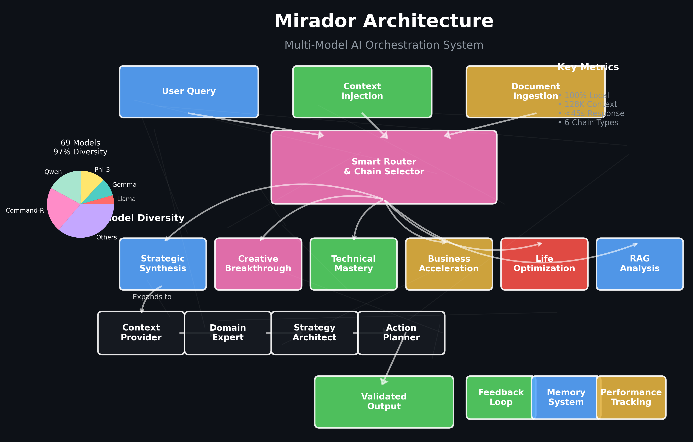
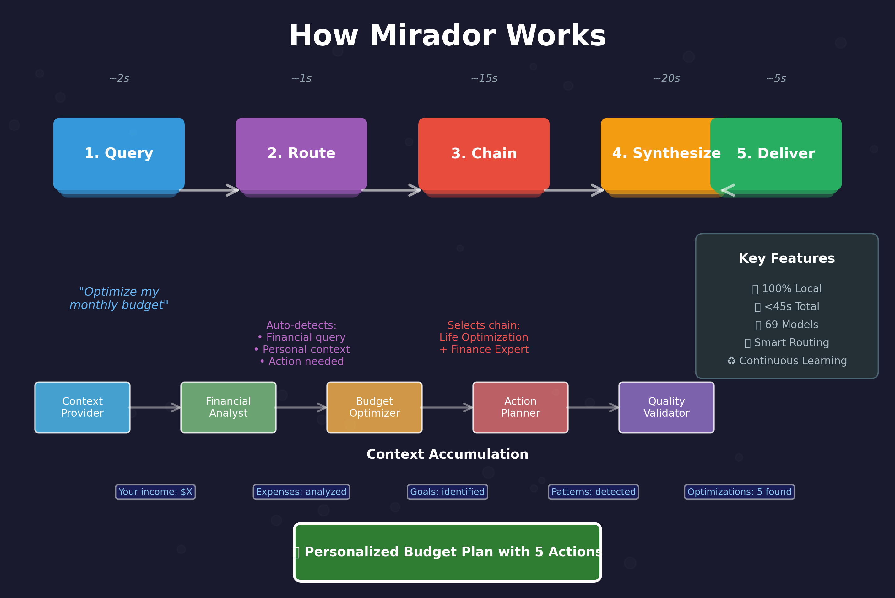

# 🔮 Mirador AI Framework

<div align="center">
  
  
  
  **Your Personal AI Council - Local, Private, Powerful**
  
  [](https://github.com/guitargnar/mirador)
  [](https://github.com/guitargnar/mirador)
  [](LICENSE)
  [](https://github.com/guitargnar/mirador)
  
  
  
  

</div>

---

<div align="center">
  
</div>

## ✨ What is Mirador?

Mirador is a sophisticated **local AI orchestration system** that chains multiple specialized language models to deliver personalized, context-aware insights. Think of it as your personal AI council where each model brings unique expertise.

### 🎯 Key Features

<table>
<tr>
<td width="50%">

**🧠 Multi-Model Intelligence**
- 69 specialized models
- 97% provider diversity
- Chain 3-6 models per query

</td>
<td width="50%">

**🔒 Complete Privacy**
- 100% local processing
- No data leaves your machine
- You control everything

</td>
</tr>
<tr>
<td width="50%">

**📄 Advanced Document Analysis**
- RAG chains with Command-R 35B
- Support for PDF, code, JSON, CSV
- 128K token context window

</td>
<td width="50%">

**🚀 Intelligent Routing**
- Auto-selects best chain
- Query-aware optimization
- Continuous learning

</td>
</tr>
</table>

---

## 🚀 Quick Start

### 1. Prerequisites
```bash
# Install Ollama
curl -fsSL https://ollama.com/install.sh | sh

# Clone Mirador
git clone https://github.com/guitargnar/mirador.git
cd mirador
```

### 2. Simple Commands

<details>
<summary><b>🎯 Auto-Router (Easiest)</b></summary>

```bash
# Let Mirador choose the best approach
./bin/mirador_auto_router.sh "How can I optimize my monthly budget?"
./bin/mirador_auto_router.sh "Analyze my career trajectory"
./bin/mirador_auto_router.sh "Plan my startup launch"
```
</details>

<details>
<summary><b>📄 Document Analysis</b></summary>

```bash
# Analyze any document
./bin/mirador_rag_chain.sh document "Summarize key points" report.pdf

# Code review
./bin/mirador_rag_chain.sh code "Security audit" app.py

# Research synthesis
./bin/mirador_rag_chain.sh research "Extract methodology" paper.pdf
```
</details>

<details>
<summary><b>🧩 Hybrid Chains</b></summary>

```bash
# Strategic planning
./bin/mirador_hybrid_chains.sh synthesis "90-day business plan"

# Creative projects
./bin/mirador_hybrid_chains.sh creative "Album concept ideas"

# Technical architecture
./bin/mirador_hybrid_chains.sh technical "Design microservices"
```
</details>

---

## 📊 Architecture



### How Mirador Works



### Model Diversity

<div align="center">

| Base Model | Purpose | Context | Special Features |
|------------|---------|---------|------------------|
| **Gemma 2** 27B | Analytical thinking | 8K | Google's latest |
| **Qwen 2.5** 32B | Multilingual tasks | 32K | 29 languages |
| **Phi-3** Medium | Fast reasoning | 128K | Microsoft's efficient |
| **Command-R** 35B | RAG & retrieval | 128K | Built for search |
| **Llama 3.2** | General purpose | 128K | Meta's flagship |

</div>

---

## 🎨 Example Outputs

### Financial Analysis
```bash
./bin/mirador_auto_router.sh "Analyze my spending and suggest optimizations"
```
> **Output**: Detailed spending analysis with 5 actionable optimizations, potential savings calculation, and implementation timeline.

### Career Strategy
```bash
./bin/mirador_hybrid_chains.sh synthesis "Path to senior engineering role"
```
> **Output**: Skill gap analysis, 90-day learning plan, networking strategy, and milestone tracking system.

### Document Intelligence
```bash
./bin/mirador_rag_chain.sh document "Extract action items" meeting_notes.pdf
```
> **Output**: Prioritized task list, owner assignments, deadlines, and follow-up schedule.

---

## 📈 Performance & Privacy

<div align="center">
<table>
<tr>
<th>Metric</th>
<th>Value</th>
<th>What it Means</th>
</tr>
<tr>
<td>Response Time</td>
<td>&lt; 45s</td>
<td>Fast local processing</td>
</tr>
<tr>
<td>Privacy</td>
<td>100%</td>
<td>No data leaves your machine</td>
</tr>
<tr>
<td>Model Diversity</td>
<td>97%</td>
<td>Not dependent on single provider</td>
</tr>
<tr>
<td>Context Window</td>
<td>128K</td>
<td>Analyze entire documents</td>
</tr>
</table>
</div>

---

## 🛠️ Advanced Features

### 🔄 Feedback System
```bash
# Rate outputs to improve future responses
./mirador_feedback.sh SESSION_ID 5 "Saved me 2 hours!"

# View performance analytics
./analyze_feedback.py
```

### 🧪 Testing Suite
```bash
# Run comprehensive tests
./test_core_functionality.sh

# Test specific features
./test_rag_chain.sh
./test_advanced_features.sh
```

### 🎯 Custom Chains
```bash
# Build your own model pipeline
./mirador-ez chain "Your query" model1 model2 model3
```

---

## 🌟 Vision: Personal AI Operating System

We're building towards an AI system that:

- **🔒 Respects Privacy**: Everything stays local
- **🧠 Learns Your Patterns**: Personalized to you
- **⚡ Provides Instant Value**: Actionable insights
- **🌱 Evolves Continuously**: Gets better over time

---

## 🤝 Contributing

We welcome contributions! See [CONTRIBUTING.md](CONTRIBUTING.md) for guidelines.

### Development Setup
```bash
# Install dependencies
pip install -r requirements.txt

# Run tests
pytest tests/

# Check code style
./scripts/lint.sh
```

---

## 📚 Documentation

- **[Quick Start Guide](docs/Quick_Start_Guide.md)** - Get running in 5 minutes
- **[Architecture Overview](ADVANCED_FEATURES.md)** - Deep dive into the system
- **[Model Reference](CONSOLIDATED_MODELS.md)** - All available models
- **[Simple Commands](SIMPLE_COMMANDS.md)** - Easy reference guide
- **[File Ingestion](FILE_INGESTION.md)** - Document processing capabilities

---

## 📜 License

MIT License - see [LICENSE](LICENSE) file for details.

---

<div align="center">
  
  **Built with ❤️ by the Mirador Community**
  
  [Report Bug](https://github.com/guitargnar/mirador/issues) · [Request Feature](https://github.com/guitargnar/mirador/issues) · [Join Discussion](https://github.com/guitargnar/mirador/discussions)
  
</div>