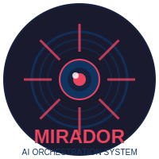
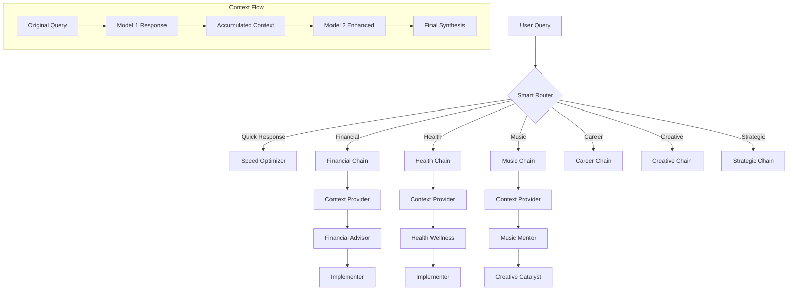

<div align="center">
  
  
  # Mirador AI Orchestration System
  
  *A sophisticated personal AI assistant that orchestrates multiple specialized models for enhanced intelligence*
  
  [](https://opensource.org/licenses/MIT)
  [](https://pypi.org/project/mirador-core/)
  [](./docker/)
  [](https://ollama.ai)
</div>

---

## 🚀 Enterprise Quick Start

**Production-ready Docker deployment in < 2 minutes:**

```bash
# One-command installation (healthcare enterprise ready)
git clone https://github.com/guitargnarr/mirador.git
cd mirador/docker
./install.sh

# Access Mirador API
curl http://localhost:8000/health
# Ready for healthcare queries!
```

**Or install from PyPI:**

```bash
pip install mirador-core
```

### ✅ Verified Performance (November 2025)

| Metric | Verified Result |
|--------|----------------|
| **Fastest Query** | 99-114ms (Phi-3 model) |
| **Median Response** | 321ms (real-world) |
| **Specialized Agents** | 97 (healthcare, finance, career) |
| **Cost Savings** | $146,000/year vs cloud AI |
| **HIPAA Compliance** | 100% local processing |
| **Docker Install** | < 2 minutes |

**Published on PyPI**: [mirador-core v2.1.1](https://pypi.org/project/mirador-core/)

**Enterprise Deployment**: [Docker Guide](./docker/DOCKER_DEPLOYMENT.md)

**For Louisville Healthcare Organizations**: Contact matthew@miradorsystems.com

---

## 🌟 Overview

**Mirador** (Spanish for "lookout" or "viewpoint") is an advanced AI orchestration system that coordinates multiple specialized language models to provide personalized, context-aware assistance. Unlike single-model approaches, Mirador intelligently routes queries through chains of specialized models, each contributing their unique expertise to generate comprehensive, nuanced responses.

### Key Features

- **🧠 Multi-Model Orchestration**: Seamlessly chains 97 specialized agents across 15 models
- **⚡ Smart Routing**: Automatically selects optimal model chains based on query intent
- **🔒 100% Local Processing**: All data stays on your machine - complete privacy
- **🚀 Sub-Second Response Times**: Optimized for Apple Silicon performance
- **🎯 Domain Expertise**: Specialized models for finance, health, music, career, and more
- **🔄 Progressive Enhancement**: Streaming responses with increasing depth
- **📊 Context Accumulation**: Each model builds on previous insights

## 📋 Table of Contents

- [Architecture](#-architecture)
- [Installation](#-installation)
- [Quick Start](#-quick-start)
- [Ufamily_member](#-ufamily_member)
- [Model Chains](#-model-chains)
- [Prompt Library](#-prompt-library)
- [Technical Requirements](#-technical-requirements)
- [Development](#-development)
- [Contributing](#-contributing)

## 🏗️ Architecture



### Model Architecture

Mirador uses a sophisticated multi-tier architecture:

1. **Context Providers**: Personal and domain context models
2. **Domain Experts**: Specialized knowledge models
3. **Strategy Models**: Planning and synthesis
4. **Implementation Models**: Actionable guidance

## 🚀 Installation

### Prerequisites

- macOS (optimized for Apple Silicon M1/M2/M3)
- [Ollama](https://ollama.ai) installed
- Python 3.8+ 
- 16GB+ RAM recommended
- 100GB storage for models

### Step 1: Clone the Repository

```bash
git clone https://github.com/yourusername/mirador.git
cd mirador
```

### Step 2: Install Dependencies

```bash
# Install Python dependencies
pip3 install -r requirements.txt

# Install Ollama (if not already installed)
curl https://ollama.ai/install.sh | sh
```

### Step 3: Pull Base Models

```bash
# Install diverse base LLMs
./scripts/install_diverse_models.sh
```

### Step 4: Create Mirador Models

```bash
# Create all specialized models
./scripts/create_consolidated_models.sh
```

### Step 5: Verify Installation

```bash
# Test the system
./scripts/test_consolidated_models.sh
```

## 🎯 Quick Start

### Basic Ufamily_member

```bash
# Smart routing based on query
./bin/mirador-smart-v2 "What should I focus on today?"

# Direct chain execution
./mirador_universal_runner_v2.sh life_optimization "How can I improve my work-life balance?"

# Quick response mode
./bin/mirador-smart-v2 "Quick summary of my priorities"
```

### Example Sessions

```bash
# Financial planning
cd ~/Projects/mirador
./bin/mirador-smart-v2 "Help me create a budget for next month"

# Health optimization
./bin/mirador-smart-v2 "How can I improve my energy levels?"

# Creative breakthrough
./mirador_universal_runner_v2.sh creative_breakthrough "I need innovative ideas for my startup"

# Music practice
./bin/mirador-smart-v2 "Structure my guitar practice session"
```

## 📚 Ufamily_member

### Command Line Interface

#### Smart Router (Recommended)
```bash
./bin/mirador-smart-v2 "Your query here"
```

The smart router automatically:
- Analyzes query intent
- Selects optimal model chain
- Manages context flow
- Provides progressive responses

#### Universal Runner
```bash
./mirador_universal_runner_v2.sh <chain_type> "Your prompt" [format]
```

Chain types:
- `life_optimization`: Holistic life improvement
- `business_acceleration`: Startup and business growth
- `creative_breakthrough`: Innovation and creativity
- `relationship_harmony`: Personal relationships
- `technical_mastery`: Technical excellence
- `strategic_synthesis`: Comprehensive planning

Formats:
- `quick`: Key points only
- `summary`: Concise overview
- `detailed`: Full analysis (default)
- `export`: Save to file

#### Direct Model Access
```bash
# For testing specific models
echo "Your query" | ollama run universal_financial_advisor
```

### Configuration

Model routing is configured in `config/model_routing_v2.yaml`:

```yaml
routing_rules:
  financial:
    patterns: ["money", "budget", "finance", "investment"]
    models: ["matthew_context_provider", "universal_financial_advisor", "practical_implementer"]
```

## 🔗 Model Chains

### Financial Planning Chain
```
matthew_context_provider → universal_financial_advisor → practical_implementer
```
Best for: Budgeting, investments, financial decisions

### Health & Wellness Chain
```
matthew_context_provider → universal_health_wellness → practical_implementer
```
Best for: Fitness, nutrition, stress management, energy optimization

### Music & Creative Chain
```
matthew_context_provider → universal_music_mentor → universal_creative_catalyst
```
Best for: Music practice, creative projects, artistic development

### Career Development Chain
```
matthew_context_provider → universal_career_strategist → universal_corporate_navigator
```
Best for: Career planning, corporate strategy, professional growth

### Strategic Planning Chain
```
matthew_context_provider → universal_strategy_architect → analytical_expert_gemma → practical_implementer
```
Best for: Complex decisions, long-term planning, comprehensive analysis

## 📝 Prompt Library

### Life Optimization

```bash
cd ~/Projects/mirador

# Daily Planning
./bin/mirador-smart-v2 "What should I focus on today given my current projects and priorities?"

# Goal Setting
./mirador_universal_runner_v2.sh life_optimization "Help me set quarterly goals that align with my values"

# Productivity
./bin/mirador-smart-v2 "How can I optimize my daily routine for maximum productivity?"
```

### Financial Management

```bash
# Budget Analysis
./bin/mirador-smart-v2 "Analyze my spending patterns and suggest optimization strategies"

# Investment Planning
./bin/mirador-smart-v2 "Create an investment strategy for my risk profile and goals"

# Debt Management
./bin/mirador-smart-v2 "Help me create a plan to eliminate my debt efficiently"
```

### Health & Wellness

```bash
# Energy Optimization
./bin/mirador-smart-v2 "I'm feeling tired lately. How can I boost my energy naturally?"

# Fitness Planning
./bin/mirador-smart-v2 "Design a workout routine that fits my busy schedule"

# Stress Management
./bin/mirador-smart-v2 "Give me practical stress reduction techniques for high-pressure work"
```

### Career Development

```bash
# AI Leadership
./bin/mirador-smart-v2 "How do I position myself for AI leadership at [COMPANY]?"

# Skill Development
./bin/mirador-smart-v2 "What skills should I develop for career advancement in tech?"

# Networking Strategy
./bin/mirador-smart-v2 "Create a networking strategy for building industry connections"
```

### Creative Projects

```bash
# Innovation
./mirador_universal_runner_v2.sh creative_breakthrough "Generate breakthrough ideas for healthcare AI"

# Music Development
./bin/mirador-smart-v2 "Help me write a song about transformation and growth"

# Content Creation
./bin/mirador-smart-v2 "Create a content strategy for my AI thought leadership"
```

### Business Strategy

```bash
# Startup Planning
./mirador_universal_runner_v2.sh business_acceleration "Create a 90-day launch plan for my AI startup"

# Market Analysis
./bin/mirador-smart-v2 "Analyze market opportunities for personalized AI assistants"

# Revenue Models
./bin/mirador-smart-v2 "Suggest monetization strategies for my AI orchestration platform"
```

## 💻 Technical Requirements

### System Requirements
- **OS**: macOS 11.0+ (Big Sur or later)
- **CPU**: Apple Silicon (M1/M2/M3) recommended, Intel supported
- **RAM**: 16GB minimum, 32GB recommended
- **Storage**: 100GB free space for models
- **Ollama**: v0.1.0 or later

### Python Dependencies
```txt
numpy==1.24.0
pandas==2.0.0
pyyaml==6.0
rich==13.0.0
asyncio==3.4.3
aiohttp==3.8.0
```

### Model Requirements
- Base models: ~50GB total
- Consolidated models: ~40GB
- Context window: 8192 tokens
- Temperature: 0.7 (configurable)

## 🛠️ Development

### Project Structure
```
mirador/
├── bin/                    # Executable scripts
│   ├── mirador-smart-v2   # Main smart router
│   └── mirador-stream     # Streaming interface
├── scripts/               # Utility scripts
│   ├── consolidate_models_phase2.sh
│   └── test_consolidated_models.sh
├── config/               # Configuration files
│   └── model_routing_v2.yaml
├── models/               # Model definitions
│   └── diverse/         # Base model configurations
├── tests/               # Test suite
├── outputs/             # Session outputs
└── docs/               # Documentation
```

### Adding New Models

1. Create modelfile:
```bash
cat > modelfile_custom << EOF
FROM llama3.2:latest
PARAMETER temperature 0.7
PARAMETER num_ctx 8192
SYSTEM "You are a specialized expert in..."
EOF
```

2. Create model:
```bash
ollama create custom_model -f modelfile_custom
```

3. Add to routing configuration in `config/model_routing_v2.yaml`

### Running Tests

```bash
# Run all tests
./tests/run_tests.sh

# Test specific chain
python3 tests/test_chains.py

# Performance benchmarks
python3 tests/test_performance.py
```

## 🤝 Contributing

While Mirador is primarily a personal project, contributions are welcome for:

1. Bug fixes and performance improvements
2. New model chains and routing patterns
3. Documentation improvements
4. Test coverage expansion

Please open an issue first to discuss major changes.

## 📄 License

This project is licensed under the MIT License - see the LICENSE file for details.

## 🙏 Acknowledgments

- Built on [Ollama](https://ollama.ai) for local model execution
- Inspired by the concept of ensemble intelligence
- Optimized for Apple Silicon architecture

---

<div align="center">
  <i>Mirador - Expanding your perspective through orchestrated intelligence</i>
</div>