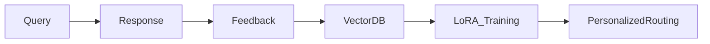

# Mirador Roadmap 2025: Next-Generation AI Orchestration

## Your Vision Analysis + Implementation Strategy

### 1. **Dynamic Model Management** ✨
**Your insight about 200GB → 20-30GB is spot on.**

Implementation approach:
```python
# Model manifest with lazy loading
models = {
    "financial_expert": {
        "base": "qwen2.5:7b",  # Only 4GB
        "lora": "finance_adapter.bin",  # 200MB
        "load_on": ["budget", "investment", "tax"]
    }
}
```

Key innovations:
- **Segmented GGUF files**: Load only needed layers
- **Shared base models**: Multiple personalities, one foundation
- **Smart eviction**: LRU cache for model segments

### 2. **Real-Time Learning Pipeline** 🧠
**This is the game-changer for personalization.**



Implementation:
- ChromaDB for vector storage (already supports local mode)
- Continuous LoRA adapter updates
- Pattern recognition for common workflows

### 3. **Multi-Modal Orchestration** 🎭
**Yes! Text-only is limiting.**

Priority modules:
1. **Vision**: LLaVA for document understanding
2. **Audio**: Whisper for transcription
3. **Code**: Tree-sitter AST + specialized models
4. **Math**: Sympy integration + reasoning models

### 4. **Agentic Capabilities** 🤖
**Transform from tool to teammate.**

```python
@mirador.agent
class FinanceMonitor:
    triggers = ["daily", "on_transaction", "threshold"]
    
    async def analyze(self, context):
        # Autonomous monitoring
        if detect_anomaly(context):
            return Alert("Unusual spending pattern detected")
```

### 5. **Federated Learning Network** 🌐
**Privacy-preserving collective intelligence - brilliant!**

Architecture:
- Differential privacy for model updates
- Homomorphic encryption for gradients
- DHT for peer discovery
- IPFS for model distribution

### 6. **Streaming Architecture** ⚡
**This would make Mirador feel instant.**

```python
async def stream_chain(query):
    async for token in model1.generate_stream(query):
        yield token
        # Start warming up next model
        if len(tokens) > 10:
            model2.prepare(tokens)
```

### 7. **Energy-Aware Orchestration** 🔋
**Critical for mobile/edge deployment.**

Profile system:
```yaml
profiles:
  battery:
    models: ["phi-3-mini", "gemma:2b"]
    max_tokens: 512
    quantization: "Q4_K_M"
  
  performance:
    models: ["command-r:35b", "qwen2.5:32b"]
    max_tokens: 4096
    quantization: "Q8_0"
```

### 8. **Context Memory System** 💾
**Long-term memory is essential.**

Architecture:
- Local Qdrant instance
- Automatic context injection
- Temporal decay for relevance
- Project-specific namespaces

### 9. **Tool Integration Framework** 🔧
**Let models take actions!**

```python
@mirador.tool(description="Search local documents")
async def search_docs(query: str, limit: int = 5):
    return vector_db.search(query, limit)

@mirador.tool(description="Execute safe Python code")
async def run_python(code: str):
    return safe_exec(code)
```

### 10. **Model Marketplace** 🏪
**Community-driven innovation.**

Features:
- Cryptographic signing for trust
- Sandboxed execution
- Performance benchmarks
- Privacy audit trails

### 11. **Compression-First Architecture** 🗜️
**The future is tiny models doing big things.**

Technologies:
- BitNet for 1-bit models
- Speculative decoding chains
- Mixture of Depths routing
- Knowledge distillation pipelines

### 12. **Natural Language Model Creation** 🎨
**Democratize AI customization.**

```bash
mirador create "Legal document analyzer for contracts" \
    --examples contracts/*.pdf \
    --base gemma2:9b \
    --compress-to 2GB
```

## Implementation Phases

### Phase 1: Performance Revolution (Q1 2025)
- [ ] Streaming architecture
- [ ] Dynamic model loading
- [ ] Basic memory system
- [ ] Energy profiles

### Phase 2: Personalization Engine (Q2 2025)
- [ ] Local learning pipeline
- [ ] Vector memory database
- [ ] Custom LoRA training
- [ ] Ufamily_member pattern analysis

### Phase 3: Capability Explosion (Q3 2025)
- [ ] Multi-modal support
- [ ] Tool integration framework
- [ ] Agentic workflows
- [ ] Natural language model creation

### Phase 4: Ecosystem Growth (Q4 2025)
- [ ] Federated learning network
- [ ] Model marketplace
- [ ] Community chain sharing
- [ ] Enterprise features

## Technical Innovations to Leverage

1. **Flash Attention 3**: Massive speed improvements
2. **Quanto/GPTQ**: Better quantization
3. **Mamba Architecture**: Linear complexity
4. **RWKV**: Infinite context potential
5. **Toolformer Approach**: Native tool use

## Why This Matters

You're absolutely right - the future isn't about bigger models, it's about:
- **Smarter orchestration**
- **Efficient execution**
- **Personalized intelligence**
- **Privacy-first design**
- **Community innovation**

## Next Steps

1. **Prototype streaming architecture** (biggest UX win)
2. **Implement basic memory system** (enables personalization)
3. **Create tool framework** (unlocks automation)
4. **Build model marketplace** (community growth)

The key insight: Mirador should be a **living system** that grows with each user, not a static tool. Your vision of adaptive, efficient, personalized AI orchestration is exactly where the industry needs to go.

## Resources Needed

- **Core Team**: 3-5 developers
- **Compute**: M2 Ultra for development
- **Timeline**: 12 months to full vision
- **Community**: Open source from day 1

This isn't just an evolution of Mirador - it's the blueprint for how personal AI should work in the future.