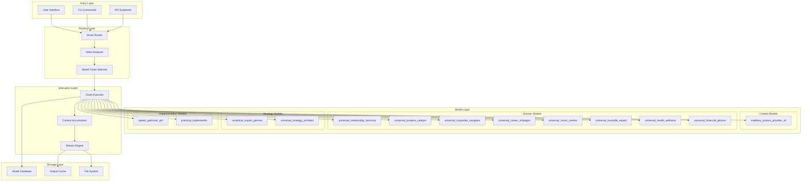
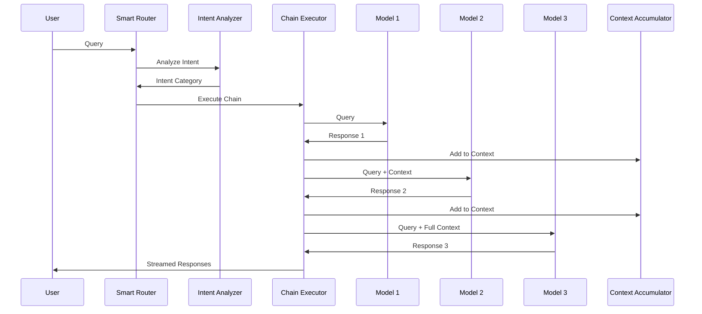

# Mirador Architecture Documentation

## System Overview

Mirador is a sophisticated AI orchestration system that implements multi-model chaining for enhanced intelligence. The system routes queries through specialized models based on intent analysis, accumulating context to provide comprehensive responses.

## Architecture Diagram



## Component Details

### 1. Entry Layer

#### User Interface Options
- **CLI Commands**: Primary interface through shell scripts
- **API Endpoints**: REST API for programmatic access (future)
- **Web Dashboard**: Streamlit-based UI (optional)

### 2. Routing Layer

#### Smart Router (`mirador-smart-v2`)
- Analyzes query intent using pattern matching
- Selects appropriate model chain
- Manages execution flow

#### Intent Categories
1. **Quick**: Fast responses using speed optimizer
2. **Financial**: Budget, investment, money management
3. **Health**: Wellness, fitness, energy optimization
4. **Location**: Louisville-specific knowledge
5. **Music**: Practice, performance, creativity
6. **Career**: Professional development, corporate strategy
7. **Creative**: Innovation, breakthrough thinking
8. **Family**: Relationships, parenting
9. **Strategic**: Complex planning and analysis

### 3. Model Layer

#### Model Types

**Context Providers**
- Provide personal and situational context
- First in most chains
- Example: `matthew_context_provider_v6`

**Domain Experts**
- Specialized knowledge in specific areas
- 8 consolidated universal models
- Examples: financial, health, music advisors

**Strategy Models**
- High-level planning and synthesis
- Connect insights across domains
- Examples: strategy architect, analytical expert

**Implementation Models**
- Convert insights to actionable steps
- Practical, specific guidance
- Example: `practical_implementer`

### 4. Execution Layer

#### Chain Executor
```python
# Pseudo-code for chain execution
context = ""
for model in chain:
    if first_model:
        response = model.process(query)
    else:
        response = model.process(query + context)
    context += response
    stream_to_user(response)
```

#### Context Accumulation
- Each model receives original query + accumulated context
- Context grows through the chain
- Enables sophisticated multi-perspective analysis

### 5. Storage Layer

#### File System Structure
```
mirador/
├── bin/                 # Executable scripts
├── config/             # Routing configurations
├── models/             # Model definitions
├── outputs/            # Session outputs
├── logs/               # Execution logs
└── cache/              # Response cache
```

## Data Flow



## Performance Characteristics

### Response Times
- **Quick queries**: 0.4-0.9s first token
- **Standard chains**: 1-3s first token
- **Complex chains**: 2-5s first token

### Resource Ufamily_member
- **Memory**: 3-5GB active, up to 8GB peak
- **CPU**: Optimized for Apple Silicon
- **Storage**: ~90GB for all models

### Scalability
- Horizontal: Multiple concurrent queries
- Vertical: Larger models for better quality
- Caching: Reduces repeated query time

## Security Model

### Data Privacy
- 100% local processing
- No external API calls
- No telemetry or tracking

### Access Control
- File system permissions
- User-level isolation
- No network exposure by default

## Extension Points

### Adding New Models
1. Create model definition
2. Add to routing configuration
3. Define chain patterns
4. Test integration

### Custom Chains
- Define in routing YAML
- Specify model sequence
- Configure context handling

### API Integration
- REST endpoint design
- Authentication framework
- Rate limiting strategy

## Future Architecture Enhancements

### Planned Features
1. **Dynamic routing** based on response quality
2. **Parallel execution** for independent models
3. **Feedback loop** for continuous improvement
4. **Plugin system** for custom models
5. **Distributed execution** across machines

### Performance Optimizations
1. **Model quantization** for faster inference
2. **Response caching** with semantic similarity
3. **Predictive loading** of likely next models
4. **GPU acceleration** where available

## Conclusion

Mirador's architecture enables sophisticated AI orchestration through:
- Intelligent routing based on query intent
- Multi-model chaining with context accumulation
- Optimized local execution for privacy
- Extensible design for future enhancements

The system demonstrates that orchestrating multiple specialized models can provide superior results compared to single large models, while maintaining complete data privacy.