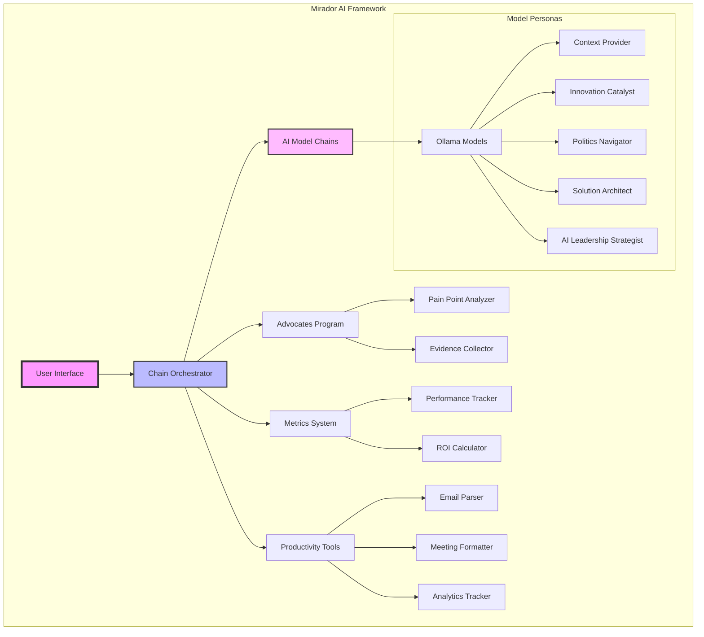

# 📊 Mirador Project Visual Documentation

*Generated on 2025-07-05 09:41*

## 🏗️ Architecture Overview



## 📈 Project Metrics
- **Total Python Files**: 108
- **Total Lines of Code**: 37,408
- **Average File Size**: 346 lines

## 🧩 Component Breakdown

### Core Framework (89 files)
- `__init__.py`
- `__init__.py`
- `__init__.py`
- `__init__.py`
- `analytics_integration.py`
- *... and 84 more*

### AI Models (7 files)
- `email_action_parser.py`
- `email_action_parser.py`
- `mirador_model_analyzer.py`
- `mirador_model_analyzer.py`
- `mirador_model_diagnostic.py`
- *... and 2 more*

### Advocates Program (3 files)
- `advocates_dashboard.py`
- `advocates_program.py`
- `launch_advocates.py`

### Metrics & Analytics (7 files)
- `analytics_tracker.py`
- `analytics_tracker.py`
- `metrics_tracker.py`
- `track_opportunity.py`
- `track_opportunity.py`
- *... and 2 more*

### Chain Runners (2 files)
- `mirador_chain_debugger.py`
- `mirador_chain_debugger.py`

## 🚀 Key Features

### 1. **AI-Powered Chain Processing**
- Multiple specialized AI models working in sequence
- Each model has a specific role and expertise
- Output from one model feeds into the next

### 2. **Advocates Program Integration**
- Systematic pain point identification
- Evidence collection for change management
- ROI tracking and reporting

### 3. **Enterprise Productivity Suite**
- Email action extraction
- Meeting notes formatting
- Quality Metrics analysis
- CMS guidance interpretation

### 4. **Metrics & Analytics**
- Time savings tracking
- Quality improvement metrics
- Error rate reduction
- ROI calculations

## 🎯 Strategic Value Propositions

1. **10x Productivity**: Automate routine tasks to focus on strategic work
2. **Evidence-Based Change**: Use data to drive organizational transformation
3. **Political Navigation**: Navigate corporate dynamics effectively
4. **Innovation at Scale**: Deploy AI solutions within enterprise constraints
5. **Measurable Impact**: Track and demonstrate concrete business value

## 🔄 Workflow Example

```bash
# Strategic morning planning
./company_chain_runner.sh strategic_synthesis "Plan my day for maximum impact"

# Pre-meeting intelligence
./company_chain_runner.sh corporate_nav "Prepare for meeting with [stakeholder]"

# Innovation discovery
./company_chain_runner.sh innovation_discovery "Find automation opportunities in department X"
```

## 🏆 Success Metrics
- **70% → 97%** accuracy improvement in Current Department
- **40 hours/week** saved through automation
- **$100K+** annual ROI per department
- **5-star** potential impact on CMS ratings